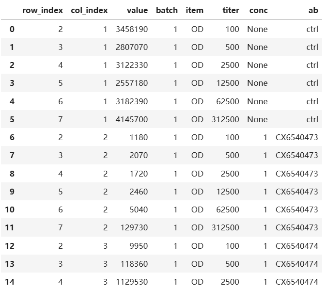

# minexcel

`minexcel` 是一个处理复杂 Excel 表格，挖掘有效数据的 python 包

# 读取 excel 中格式化的数据 block


excel 中格式化的数据 block 常常难以被简单读取，在涉及到合并单元格时更是如此。`minexcel` 将数据 block 抽象为几种组成部分，并支持用简易的标记表示

你可以新建一个`.xlsx`文件，按以下格式输入数据 block 的模板：

- `[tablemeta]`：表格元数据。每个 block 可以有多个表格元数据，但每个表格元数据只能有一个值

- `[rowmeta]`：行元数据。数据在行方向的扩展信息，包括传统的行名

- `[colmeta]`：列元数据。数据在列方向的扩展信息，包括传统的列名

- 留空：核心数据区域。该区域应该无行名、无列名

- `[ignore]`：解析时忽略的单元格。注意，原表格中元数据名称所在的单元格，应标记为`[ignore]`


随后，使用 `minexcel` 解析

```python
import minexcel as mxl

tmpl = mxl.parse_template("template.xlsx")
res = mxl.read_block_excel("data.xlsx", tmpl)
```

可得到结构化的数据


