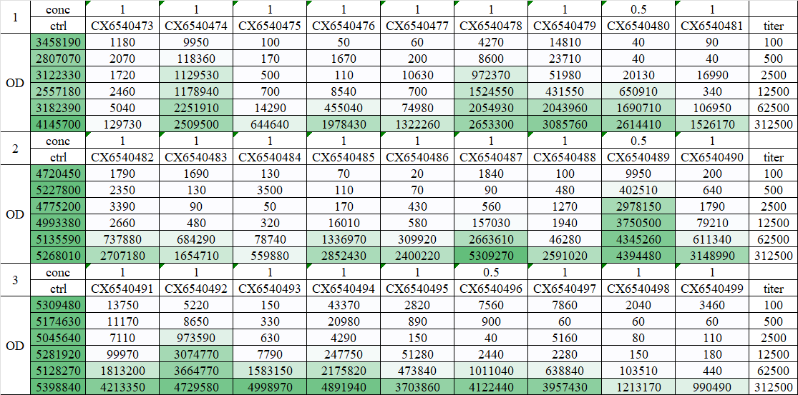
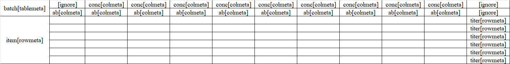
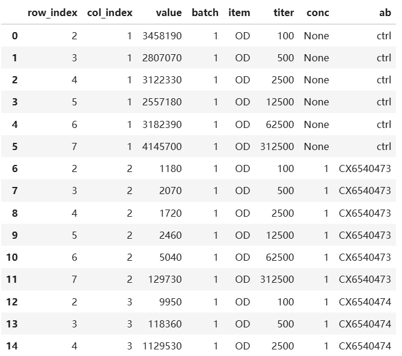

# minexcel

[中文文档](index-CN.md)

`minexcel` is a Python package designed for processing complex Excel tables and extracting structured data blocks from formatted layouts.

```
pip install minexcel
```

# Reading Formatted Data Blocks in Excel



Formatted data blocks in Excel are often challenging to parse, especially when merged cells are involved. `minexcel` abstracts the cells in data block into distinct components and supports simplified markup for configuration.

To define a template, you can create a new `.xlsx` file and structure your data block as follows:

- `[tablemeta]`: Table metadata. Each block can have multiple table metadata entries, but each entry must contain a single value.

- `[rowmeta]`: Row metadata. Represents row-wise extended information, including traditional rownames.

- `[colmeta]`: Column metadata. Represents column-wise extended information including traditional colnames.

- Leave empty: Core data area. This region should contain no rowname or colname.

- `[ignore]`: Cells to skip during parsing. Note: The original cell containing the metadata name must be marked as `[ignore]`.



Use `minexcel` to parse the data:

```python
import minexcel as mxl

tmpl = mxl.parse_template("template.xlsx")
res = mxl.read_block_excel("data.xlsx", tmpl)
```

This returns structured data matching the template's design:


